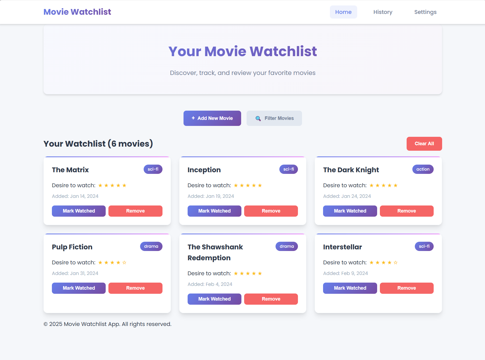
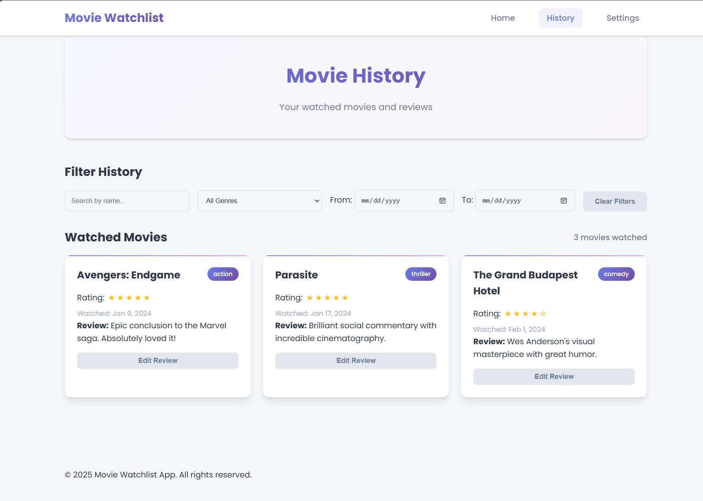
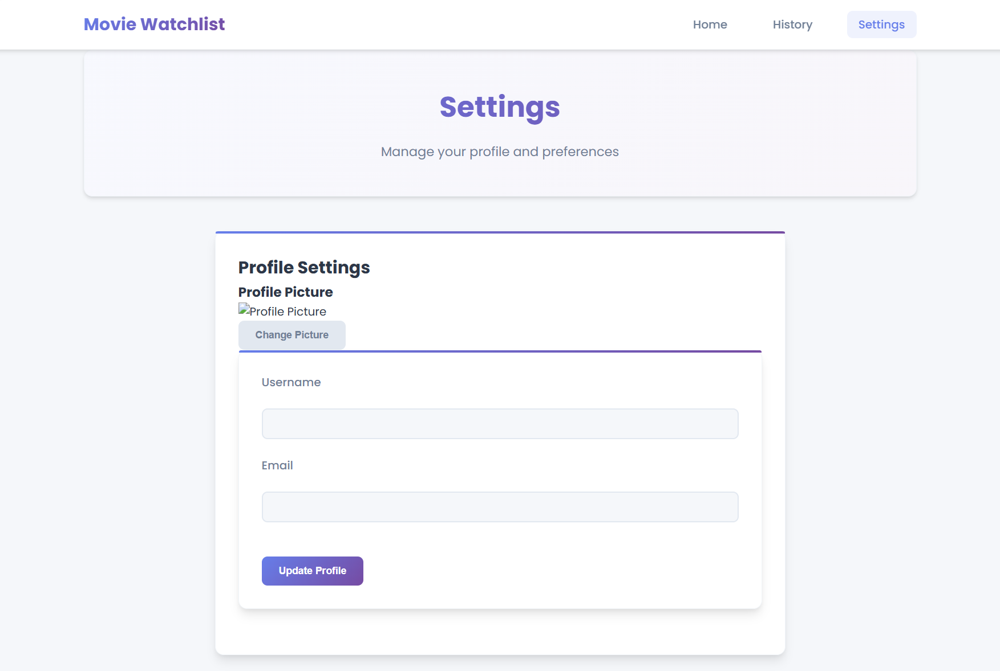

# Movie Watchlist Application

A web application that allows users to track movies they want to watch and have already watched, providing a seamless way to manage your movie-watching experience.

## Pages and Features

### feature/week9 improvements

Some of the requirements were hit in the previous deliverable. In addition to this, we implemented the login and registration form page. We changed the font, and made filter inputs hidden but expandable.
We have several hover over effects throughout the app and all pages are responsive to screen size.

### Home Page

**Purpose:** Main landing page for users to view and manage their movie watchlist.

**What's Visible:**

- Navigation bar with links to Home, History, and Settings pages
- A hero section with the app title and description
- Movie addition form with fields for title, genre, and desire-to-watch scale
- Filtering options (by name, genre, desire level)
- Grid display of unwatched movies with:
  - Movie title and genre
  - Desire-to-watch rating (1-5 stars)
  - Options to mark as watched or remove from list
- Empty state display when no movies are added



### History Page

**Purpose:** Shows all movies that have been watched, along with user ratings and reviews.

**What's Visible:**

- Complete watched movie history
- Filtering options (by name, genre, watch date)
- For each movie:
  - Title and genre
  - User rating (1-5 stars)
  - Date watched
  - User's review
  - Option to edit review and rating
- Statistics showing total movies watched


### Settings Page

**Purpose:** Allows users to customize their profile and application preferences.

**What's Visible:**

- Profile settings section:
  - Profile picture upload
  - Username and email fields
- Password management:
  - Change password form
- Theme selection:
  - Light/dark mode toggle
- Account actions:
  - Clear watchlist data
  - Delete account options



## Technology Stack

- **Frontend:** HTML, CSS, JavaScript
- **Backend:** Node.js with Express
- **Templating:** EJS for dynamic page rendering
- **Database:** PostgreSQL for data storage
- **Security:** Helmet, CSRF protection, secure sessions

## Project Structure

```
├── src/
│   ├── server.js           # Server entry point
│   ├── app.js              # Express app configuration
│   ├── routes/             # Route definitions
│   │   └── index.js        # Main route handlers
│   ├── controllers/        # Request handlers
│   │   └── homeController.js # Home page controller
│   ├── views/              # EJS templates
│   │   ├── index.ejs       # Home page (watchlist)
│   │   ├── history.ejs     # Movie history page
│   │   ├── settings.ejs    # User settings page
│   │   ├── error.ejs       # Error page
│   │   └── layout.ejs      # Main layout template
│   └── public/             # Static files
│       ├── css/            # Stylesheets
│       │   └── style.css   # Main stylesheet
│       ├── js/             # Client-side JavaScript
│       │   ├── main.js     # Main JavaScript file
│       │   ├── history.js  # History page functionality
│       │   └── settings.js # Settings page functionality
│       └── images/         # Image assets
│           └── default-avatar.png # Default user avatar
├── db/
│   ├── migrations/         # Database migrations
│   ├── seeds/              # Database seeds
│   ├── migrate.js          # Migration runner
│   ├── seed.js             # Seed runner
│   └── reset.js            # Database reset script
├── .env.example            # Environment variables template
├── .eslintrc.json          # ESLint configuration
├── .prettierrc.json        # Prettier configuration
├── package.json            # Dependencies and scripts
└── README.md               # Project documentation
```

## Features

- 🎬 **Movie Management** - Add, remove, and track movies you want to watch
- ⭐ **Ratings & Reviews** - Rate and review movies you've watched
- 🔍 **Powerful Filtering** - Find movies by name, genre, rating, or date
- 🌓 **Theme Switching** - Toggle between light and dark mode
- 📱 **Responsive Design** - Works on desktop, tablet, and mobile devices
- 🔒 **User Authentication** - Secure login and registration

## Getting Started

1. **Clone the repository**

   ```bash
   git clone https://github.com/UWO-CS346-Fall-25/cs346f25-movie-watchlist-app.git
   cd cs346f25-movie-watchlist-app
   ```

2. **Install dependencies**

   ```bash
   npm install
   ```

3. **Set up environment variables**

   ```bash
   cp .env.example .env
   # Edit .env with your database credentials
   ```

4. **Set up PostgreSQL database**

   ```bash
   # Create database
   createdb movie_watchlist
   ```

5. **Run migrations**

   ```bash
   npm run migrate
   ```

6. **Start the application**

   ```bash
   npm run dev
   ```

7. **Open your browser**
   ```
   http://localhost:3000
   ```

## Available Scripts

- `npm start` - Start production server
- `npm run dev` - Start development server with auto-reload
- `npm run migrate` - Run database migrations
- `npm run seed` - Seed database with sample data
- `npm run lint` - Check code for linting errors
- `npm run format` - Format code with Prettier
